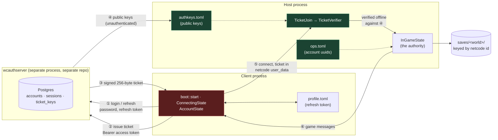

# Wyvencraft — how the systems communicate

Wyvencraft is built out of parts that deliberately do not know about each other. Nine
`wyven-*` engine crates know nothing about grass, zombies or survival mode. An account
server runs in a different process, in a different repository. A multiplayer host and its
clients share no memory at all. Everything those parts need from each other crosses a
boundary — a trait, an HTTP call, or a message on a wire.

These documents describe those boundaries: **who is allowed to tell whom what, and what
happens when the answer is no.**

They are written for reading with a security question in mind. So the organising question
throughout is not "how does this work" but "what is this peer permitted to assert, what is
it merely reporting, and which way does it fail" — and where the current answer is weaker
than it looks, that is stated where the mechanism is described rather than filed away in an
appendix.

| Document | Read it for |
| --- | --- |
| [identity-and-auth.md](identity-and-auth.md) | Accounts, tokens, join tickets, key distribution, `ops.toml`. How a stranger becomes a named player. |
| [netcode.md](netcode.md) | The wire protocol, the authority model, the join handshake, chat and commands. |
| [systems-map.md](systems-map.md) | Everything else at map depth: the engine/game traits, the frame loop, ports and adapters, the render seam, chunk streaming, threads. |

For *where to change what* — adding a block, tuning a mob, writing a chat command — see
[`CLAUDE.md`](../CLAUDE.md) instead. It is a map of locations; this is a map of
conversations. The two are meant to be complementary, not competing.

---

## The four parties

Four properties fall out of that shape, and they explain most of the code:

**The ticket is requested at join time, not login time.** It lives 120 seconds. Caching one
is pointless; requesting one per join click is correct.

**The host verifies offline.** Step ⑤ never contacts the auth server — it only needs the
public keys already cached from step ④. A host admits legitimate players while the auth
server is down. The corollary is that a host which has *never* reached it has no keys and
turns everyone away.

**Verification happens before a `PlayerId` exists.** A rejected peer never receives a
`Welcome`, never appears in the player list, and leaves nothing to clean up.

**No keys means no joins**, never "everyone joins". A missing or malformed `authkeys.toml`
yields an empty key set, and an empty key set refuses everyone. The fail-soft direction is
deliberately toward refusal.

---

## What is proven, and what is merely claimed

This is the table to read first. Once a peer is admitted, the host does *not* treat
everything it says with equal suspicion.

| Claim a client makes | Status | Where it is settled |
| --- | --- | --- |
| Which account I am | **Proven** — Ed25519 signature over a server-issued ticket | `crates/wyven-auth/src/verifier.rs:63` |
| That the ticket is mine, not copied from someone connecting alongside me | **Proven** — the netcode id is derived from the account uuid and must match | `src/net/join.rs:82` |
| That I have not replayed this ticket against this host | **Proven** — nonce cache, held until the ticket could no longer verify | `crates/wyven-auth/src/verifier.rs:83` |
| That I am an operator | **Proven** — `ops.toml` is keyed on the ticket's account uuid | `src/chat/ops.rs:85`, `src/state/ingame_state/chat.rs:141` |
| That I ran a command | **Proven** — the client never executes; only the host parses and dispatches | `src/state/ingame_state/chat.rs:65` |
| Where I am standing | *Claimed* — accepted verbatim | `src/state/ingame_state/net.rs:171` |
| My health, hunger, saturation | *Claimed* — the host mirrors them to persist them | same |
| What is in my inventory | *Claimed* — the host mirrors it for the save | same |
| Which game mode I am in | *Claimed* | same |
| That I may break or place this block | *Claimed* — applied with no reach, tool, or inventory check | `src/state/ingame_state/net.rs:215` |
| That my swing reached that mob | *Partly checked* — range-validated, but against my own claimed position | `src/state/ingame_state/net.rs:273` |

The claimed rows are not oversights of equal weight. Vitals and inventory are *deliberately*
client-owned — the comments say so, and `GrantItems` is written as an instruction to add
rather than a state overwrite precisely because the client is the owner. Block edits are a
different case: they are simply unvalidated. Both are described where they live, in
[netcode.md](netcode.md#2-the-authority-model).

The honest summary is that **the join gate is the security boundary, and very little behind
it is.** Wyvencraft is a game you host for people you invited. The ticket system exists so
that "who is in my world" and "who may run `/give`" are answerable questions — not so that
an admitted player is sandboxed from the simulation.

---

## Who decides what

| Domain | Decided by | Everyone else |
| --- | --- | --- |
| Terrain | Nobody — regenerated from the shared seed | identical by construction |
| Block edits | Host applies and echoes | clients apply optimistically, then receive the echo |
| Fluids | Host only | receive ordinary `BlockChanged` |
| Mobs — spawning, AI, death | Host only | hold render-only replicas |
| Melee damage to mobs | Host | receives `MobHurt` / `MobDespawned` |
| Mob damage to a player | Host decides the amount, **the target applies it** | target mitigates through its own armor, reports back |
| Loot from a kill | The killer, locally | seeded from `world_seed ^ mob_id`, so it matches without being sent |
| Player position / vitals / inventory | **Each client, for itself** | host mirrors to persist and relay |
| Crafting recipes | Host, sent in the `Welcome` | local `recipes.toml` is ignored |
| Chat and commands | Host, exclusively | clients send raw lines and display replies |
| Permissions | Host, from `ops.toml` + verified account | clients never read the file |
| Time of day | Seeded once at join, then local | drifts between peers |
| The world save | Host only | clients hold a null repository |
