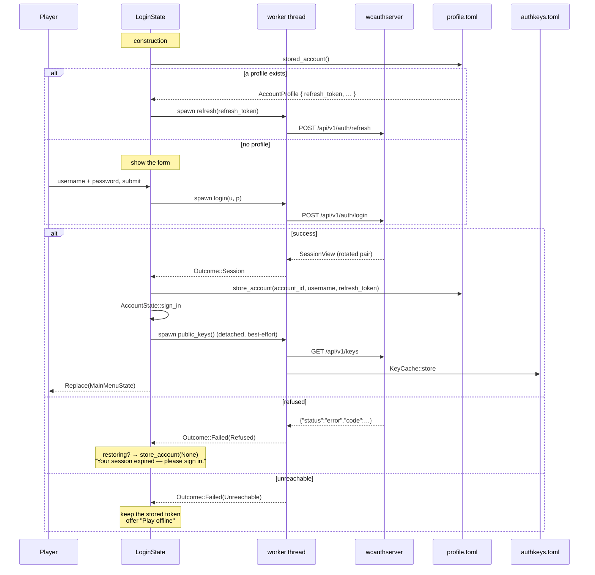

# Identity and authentication

How a player proves who they are, and how a host checks it.

Part of the [communication docs](README.md); the protocol a verified player then speaks
is [netcode.md](netcode.md).

Two halves that never meet in-process:

- **The client half** — `wyven-auth::{client, session, account}` talks HTTP to
  [`wcauthserver`](https://github.com/gustaavik/wcauthserver) and comes back with an
  `AuthSession` and, at join time, a `JoinTicket`.
- **The host half** — `wyven-auth::{keys, verifier}` plus `src/net/join.rs` verifies a
  ticket presented in netcode's `user_data`, entirely locally, against public keys cached in
  `authkeys.toml`. **It makes no network call.**

That split is the whole design. A host's ability to admit players does not depend on the
auth server being up; it depends only on having fetched its keys at some point in the past.

`wyven-auth` depends on nothing but `wcauth-ticket` and `ureq` — no window, no GPU, no
socket — which is why it is testable in isolation and why it is the **only** engine crate
that names the private wcauthserver repo. The other eight build with no GitHub credential.

---

## 1. The ticket, and why it is shaped that way

The game does not reimplement the ticket format. It compiles **the server's own crate**,
`wcauth-ticket`, pulled from the wcauthserver repo and pinned by `Cargo.lock`. Serialization
*is* the byte layout — no serde, no JSON. Base64 appears only at the HTTP boundary.

| Offset |    Size | Field                                          |
| -----: | ------: | ---------------------------------------------- |
|      0 |       1 | version (`VERSION = 1`)                        |
|      1 |       1 | key id (`u8`)                                  |
|      2 |      16 | account uuid, raw bytes                        |
|     18 |       1 | username length, 1..=16                        |
|     19 |      16 | username UTF-8, **zero-padded**                |
|     35 |       8 | `issued_at`, unix seconds, little-endian       |
|     43 |       8 | `expires_at`, unix seconds, little-endian      |
|     51 |      16 | nonce                                          |
|        |  **67** | `SIGNED_LEN` — the bytes the signature covers  |
|     67 |      64 | Ed25519 signature over `bytes[0..67]`          |
|        | **131** | `TICKET_LEN`                                   |
|    131 |     125 | zero padding                                   |
|        | **256** | `SLOT_LEN` — exactly `NETCODE_USER_DATA_BYTES` |

Lifetimes: `DEFAULT_TTL_SECS = 120`, `MAX_TTL_SECS = 600`, `CLOCK_SKEW_SECS = 30`.

**The verification order is the security property.** Not the signature algorithm — the
order:

1. version byte
2. key lookup by id
3. **Ed25519 signature over `bytes[0..67]`**
4. *only now* decode the payload — username length, zeroed padding, UTF-8 validity
5. lifetime sanity (`expires_at - issued_at <= 600`)
6. clock window (`now + 30 >= issued_at`, `now <= expires_at + 30`)

Nothing derived from unverified bytes is used for anything, including deciding whether the
bytes look well-formed. A malformed username in a badly-signed ticket is rejected for the
signature, never for the username.

The 16-character username ceiling in the wire format is *why* the auth server enforces a
16-character username limit, not the other way round.

---

## 2. Signing in

`LoginState` is the first screen. It owns an `Arc<dyn AuthClient>` and runs every request on
a one-shot worker thread, polling a channel each frame — the UI never blocks on HTTP.



The asymmetry in the last two branches is deliberate and worth not undoing: a **refused**
restore clears the stored token, because it is dead; an **unreachable** server keeps it,
because a network blip must not sign you out.

`AuthError` has exactly three variants and the distinction is load-bearing
(`crates/wyven-auth/src/client.rs:27`):

```rust
Refused { code: String, message: String }  // the server said no
Unreachable(String)                        // could not reach it   -> is_offline() == true
Malformed(String)                          // it said something unexpected
```

`is_offline()` is the single branch the UI consults to decide whether to *offer* offline
play. Offline is never a standing "skip login" button — it appears only after an actual
`Unreachable`, and it does not unlock multiplayer.

### The port

`AuthClient` (`crates/wyven-auth/src/client.rs:65`) is `Send + Sync` because every call site
moves it into a worker thread:

| Method         | Endpoint                       | Notes                                             |
| -------------- | ------------------------------ | ------------------------------------------------- |
| `register`     | `POST /api/v1/auth/register`   | → 201 `SessionView`                               |
| `login`        | `POST /api/v1/auth/login`      | → 200 `SessionView`                               |
| `refresh`      | `POST /api/v1/auth/refresh`    | returns a **rotated pair**; the old token is dead |
| `issue_ticket` | `POST /api/v1/sessions/ticket` | Bearer access token, **empty body**               |
| `public_keys`  | `GET /api/v1/keys`             | unauthenticated by design                         |

Real impl `HttpAuthClient` (`crates/wyven-auth/src/client.rs:85`) — blocking `ureq`, 10 s
global timeout, deliberately not `reqwest` because the game has no async runtime. Test
double `FakeAuthClient` is a real in-memory implementation, not a mock: it actually signs
tickets that verify against the key set it publishes, which is what makes the auth tests
meaningful without a server.

---

## 3. Joining

The ticket is fetched **here**, not at sign-in, because it lives about two minutes.

```mermaid
sequenceDiagram
    participant C as ConnectingState
    participant A as AccountState
    participant S as wcauthserver
    participant N as netcode transport
    participant H as Host::pump
    participant V as TicketJoin
    participant G as InGameState (host)

    C->>A: can_play_multiplayer()?
    alt not signed in
        A-->>C: false
        Note over C: "Sign in to play with other people."<br/>no thread, no socket
    end

    C->>A: issue_ticket(client, now)
    opt access token within 60 s of expiry
        A->>S: POST /auth/refresh
        S-->>A: rotated pair
        A->>A: store it BEFORE using it
    end
    A->>S: POST /sessions/ticket (Bearer)
    S-->>A: base64 → [u8; 256]

    C->>N: Client::connect(addr, netcode_id, PROTOCOL_ID, Some(slot))
    N->>H: ServerEvent::ClientConnected { client_id }
    H->>V: verify(user_data, client_id, now)

    alt any check fails
        V-->>H: Err(reason)
        H->>H: log::warn!("refused client …")
        H->>N: disconnect(client_id)
        Note over H,G: no PlayerId minted.<br/>the game layer never learns it existed
        Note over C: sees only a transport drop,<br/>then the 12 s timeout
    else verified
        V-->>H: AccountIdentity { account_id, username }
        H->>H: pid = PlayerId(next_player_id++)
        H->>G: Inbound::Joined { player, identity, account }
        G-->>C: Welcome { seed, your_id, content_hash, recipes, restored, … }
        G-->>C: PlayerJoined { id, name: account.username }
    end
```

**The rotation discipline in `AccountState::issue_ticket`
(`crates/wyven-auth/src/account.rs:142`) is the part worth copying anywhere else that talks
to this server.** A refresh token is single-use. Replaying a consumed one is read by the
server as theft and revokes the entire session family — signing the user out everywhere. So
the rotated pair is stored *before* the ticket request that might fail:

```rust
let session = if session.access_token_usable(now_unix) {
    session
} else {
    let refreshed = client.refresh(&session.refresh_token)?;
    self.sign_in(refreshed.clone());   // stored BEFORE the ticket call
    refreshed
};
client.issue_ticket(&session.access_token)
```

### The gate itself

`TicketJoin` (`src/net/join.rs:39`) is this game's `wyven_net::JoinVerifier`. The engine's
`Host` calls it on `ClientConnected` and knows nothing about tickets. Two checks:

```rust
let identity = verifier.verify(user_data, now_unix).map_err(|err| err.to_string())?;

// The netcode id is derived from the account, so a client claiming one
// id while holding a ticket for another is trying something. Refusing
// keeps `identity -> save record` a function rather than a suggestion.
if identity.netcode_id() != client_id {
    return Err(format!(
        "ticket is for {} but the client connected as {client_id}",
        identity.netcode_id()
    ));
}
```

That second check is what stops `WYVEN_CLIENT_ID` from being useful for anything but running
two clients from one directory. The netcode id keys the save record, so without it, "which
saved player am I" would be a client's own assertion.

Underneath, `TicketVerifier::verify` (`crates/wyven-auth/src/verifier.rs:63`) adds the
replay cache. A ticket is a bearer credential for its whole 120-second life; recording the
nonce makes it single-use *against this host*, which is the difference between "anyone who
copies this can join repeatedly" and "anyone who copies this has one race against the real
player". Nonces are forgotten only once `now > expires_at + CLOCK_SKEW_SECS`, so a nonce is
never dropped while a ticket carrying it would still verify.

### Refusals

| Condition                                      | Result                  | Note                                                                                     |
| ---------------------------------------------- | ----------------------- | ---------------------------------------------------------------------------------------- |
| Host has no keys                               | `VerifyFailure::NoKeys` | Checked **before** `Missing` — a keyless host says so even for a peer presenting nothing |
| No ticket in `user_data`                       | `Missing`               | An old client, or a hand-built packet                                                    |
| Wrong version / unknown key id / bad signature | `Invalid(TicketError)`  | Signature is checked before any payload decode                                           |
| Bad username length, padding, or encoding      | `Invalid(TicketError)`  | Only reachable *after* a valid signature                                                 |
| Outside the clock window, or lifetime > 600 s  | `Invalid(TicketError)`  | The host applies its own cap to an issuer it did not run                                 |
| Nonce already spent here                       | `Replayed`              |                                                                                          |
| Ticket valid but `netcode_id != client_id`     | refused by `TicketJoin` |                                                                                          |

**The reason is logged, never sent.** `JoinVerifier::verify` returns `Result<_, String>` and
the engine logs it; a refused peer learns only that it was dropped. "Expired" versus "bad
signature" is not an oracle. The observable client-side symptom for every row above is
identical: a transport drop, then the 12-second timeout in `ConnectingState`.

---

## 4. Key distribution

`authkeys.toml`, CWD-relative and gitignored, written atomically (temp + rename):

```toml
[[keys]]
id = 1
public_key = "GX9rI+FshTLGq8g4+s1ep4m+DHaykgM0A5v6iz02jWE="
```

The base64 is exactly what `GET /api/v1/keys` returns — the raw 32-byte Ed25519 key, not
SPKI, not PEM. The endpoint returns **every** key including retired ones, ordered by
creation, so tickets signed just before a rotation still verify.

`KeyCache::load` is fail-soft **toward refusal** (`crates/wyven-auth/src/keys.rs:17`):
a missing file, unparseable TOML, or entries that are all unusable each yield an empty key
set, and an empty key set refuses every join. Individual bad entries are skipped with a
warning rather than discarding the rest, so one malformed line during a rotation cannot lock
out the working key. `store` **replaces** rather than appends.

**Exactly two places write it**, and neither is a background task:

| Site                                            | When                                                 | Blocking?                                                         |
| ----------------------------------------------- | ---------------------------------------------------- | ----------------------------------------------------------------- |
| `src/state/login_state.rs:166` (`refresh_keys`) | after every successful sign-in, register, or restore | no — detached thread, failures logged only                        |
| `src/boot/start.rs:65` (`boot_account`)         | after a `WYVEN_USERNAME` dev-boot login              | yes — synchronous, so a `WYVEN_HOST=1` boot can verify its guests |

Three consequences follow, and all three surprise people:

- **There is no periodic refresh.** Keys are fetched when you sign in, and at no other time.
- **A host that has never signed in has no keys and refuses everyone.** This is the intended
  failure direction, but the only signal is a `log::warn!` at bind plus one per refusal.
  `Host::can_verify()` exists but nothing in `src/` currently surfaces it in the UI.
- **`TicketJoin::from_cache()` snapshots at bind.** Editing `authkeys.toml` while a host is
  running has no effect until it rebinds.

---

## 5. `profile.toml`

CWD-relative, gitignored, written atomically:

```toml
client_id = "1787242050468846896"

[account]
account_id = "67757374-6176-0000-0000-000000000000"
username = "gustav"
refresh_token = "…"
```

What is **not** there matters as much as what is: no access token and no expiry. The access
token lives 15 minutes and is worthless across a restart. Only the refresh token persists —
single-use, rotated on every use, and revocable server-side.

`client_id` is separate and older: it is the netcode identity used when there is no account
to derive one from. `WYVEN_CLIENT_ID` overrides it, which is how you run two clients from
one directory — and, thanks to the `netcode_id` cross-check in `TicketJoin`, is not a way to
impersonate anyone.

---

## 6. Offline

`AccountStatus::Offline` is reached only after an actual `Unreachable`, and it clears the
stored session. Concretely it means:

- `can_play_multiplayer()` is false, so the Multiplayer button is greyed **and**
  `ConnectingState` refuses independently — the greyed button is a courtesy, the state is
  the gate.
- `issue_ticket` returns `Refused { code: "not_signed_in" }`.
- `netcode_id()` is `None`, so the identity falls back to `save::local_identity()`.
- The main menu shows "Playing offline".

**Hosting is not blocked by being offline.** It is blocked by having no keys — a different
condition that usually coincides. Singleplayer is entirely unaffected.

---

## 7. Permissions

`ops.toml` is the one place a verified identity turns into an authority to *do* something.

```toml
ops = [{ id = "0f8e…-…", name = "gustav" }]
```

Keyed by **account uuid from a verified ticket** (`src/chat/ops.rs:85`). Player ids are
per-session and shift on reconnect, so they cannot carry a permission.

The chain of custody is worth tracing once, because every link is what makes the next one
meaningful:

```
wcauthserver signs TicketClaims { account_id, username, nonce }
  → base64 over HTTPS to the client
  → netcode user_data, 256 bytes
  → TicketVerifier::verify  (Ed25519 + replay cache)
  → AccountIdentity { account_id }
  → TicketJoin cross-checks netcode_id() == client_id
  → Host.accounts[pid]
  → Inbound::Joined { account }
  → peers.accounts[pid]
  → OpsList::is_op(&account.account_id)
```

`peers.accounts` is written from nowhere else, which is what lets
`src/state/ingame_state/chat.rs:141` be this short:

```rust
fn is_op(&self, actor: PlayerId) -> bool {
    if actor == self.session.local_id() { return true; }   // the host owns the process
    self.peers
        .accounts
        .get(&actor)
        .is_some_and(|account| self.ops.is_op(&account.account_id))
}
```

A player with no recorded account is never an op. The file is loaded only on the authority —
a client never authorizes anything, so it never reads it.

This replaced a genuine vulnerability, and the shape of it is worth remembering: `ops.toml`
used to be keyed by the client's own `profile.toml` id, which the client asserted for itself
over an unauthenticated handshake. Anyone who learned an op's number *became* that op by
setting one environment variable. The fix was not a better check on the number — it was
keying on something the client cannot mint.

---

## 8. Cross-repo hazards

**The `netcode_id` derivation is hand-duplicated in both repos and must stay identical**, or
every join fails the `netcode_id != client_id` check:

```rust
// crates/wyven-auth/src/session.rs:27
let (high, low) = account_id.as_u64_pair();
(high ^ low).max(1)
```

`.max(1)` reserves `PlayerId(0)` for the host's local player. The server's
`domain::account::AccountId` carries the same expression.

**`wcauth-ticket` is pinned by commit in `Cargo.lock`.** Advance it deliberately with
`cargo update -p wcauth-ticket`. A differing repo HEAD is not by itself a problem — compare
the *ticket crate*, since the server moves for reasons that never touch the contract:

```sh
PIN=$(grep -A2 'name = "wcauth-ticket"' Cargo.lock | sed -n 's/.*#\([0-9a-f]*\)".*/\1/p')
git -C ../wcauthserver diff --stat "$PIN"..main -- crates/ticket
```

Empty output means the pin is stale but the contract is not.

**Do not let `wcauth-ticket` spread past `wyven-auth`.** It is the only crate that may name
the private repo, and that is what lets the other eight engine crates build with no GitHub
credential. If a second crate needs identity, it needs a trait, not the dependency.

---

## What the auth server does not do

Verified absent — do not design around assuming otherwise:

- **No rate limiting of any kind.** No middleware, no per-IP or per-account counters, no
  lockout. The server never emits 429, despite the game client having a 429 branch. Login is
  protected only by Argon2 cost.
- **No CORS layer**, so a browser-based launcher will not work against it as-is.
- **No JWKS route.** Only ticket keys are published; the access-token verification key is
  env-only.
- **No logout-all, password-change, account-deletion, or email-verification routes.**

Full endpoint reference, error codes and token model live in the `wyvencraft` skill at
`~/.claude/skills/wyvencraft/references/auth-protocol.md`, which covers the server side in
depth.
