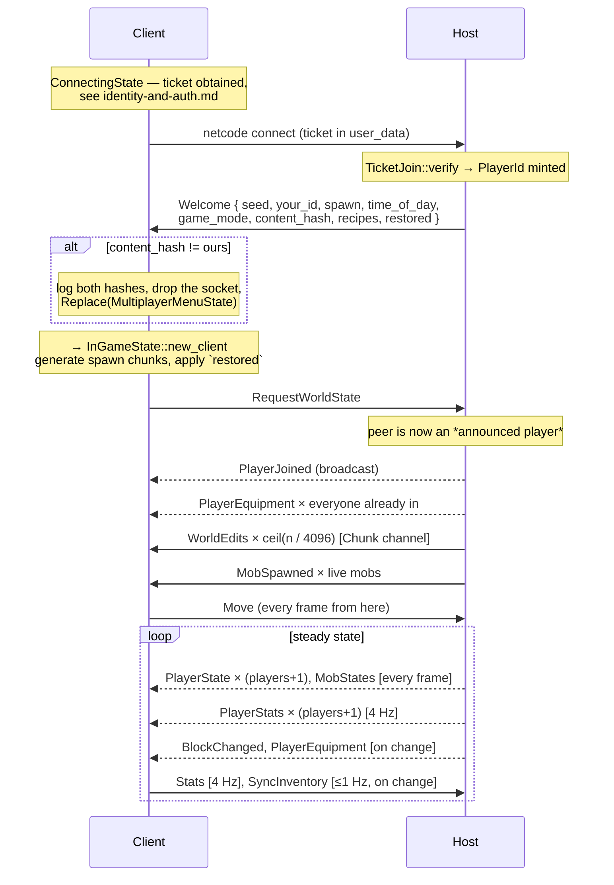
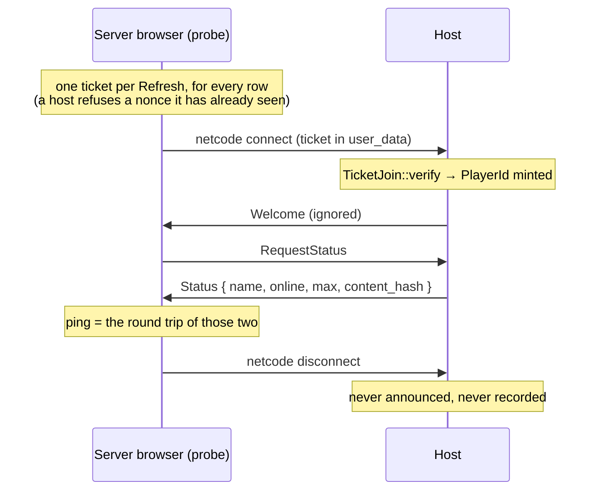
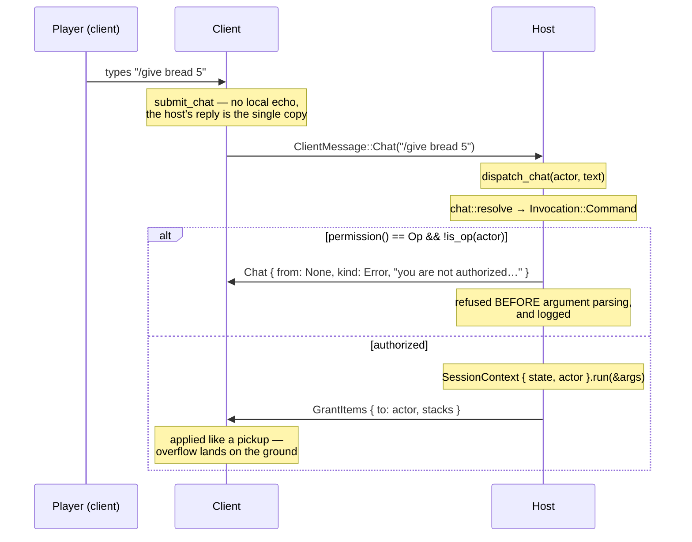

# Netcode

How a host and its clients talk, what each is allowed to decide, and what happens when the
conversation breaks down.

The stack has four layers, and the split between the bottom two is the interesting one:

```
crates/wyven-net              transport only — sockets, channels, the join gate.
      ▲                       Generic over <P: Protocol, V: JoinVerifier>.
      │                       Knows nothing about blocks, inventories or accounts.
src/net                       this game's wire format: WyvenProtocol, TicketJoin,
      ▲                       ClientMessage / ServerMessage
src/state/session             the `Session` port: Singleplayer / Host / Client / Fake
      ▲
src/state/ingame_state/net.rs interpretation — what a message *does* to the world
```

`wyven-net` depends only on `wyven-core`, `renet`, `renet_netcode`, `serde`, `bincode` and
`log`. It compiles without the private ticket crate, which is exactly the point: the
transport is not where identity lives.

---

## 1. Transport

renet 2.0 + `renet_netcode` 2.0 over UDP. A host binds `0.0.0.0:25565` by default
(`crates/wyven-net/src/server.rs:21`); a client binds an ephemeral port and connects.

| Setting              | Value                            | Where                                                                           |
| -------------------- | -------------------------------- | ------------------------------------------------------------------------------- |
| Protocol id          | `0x5759_564E_0001` (`"WYVN"` v1) | `src/net/join.rs:12` — the *game* picks it; the engine takes it in `HostConfig` |
| Max clients          | 16                               | `src/net/join.rs:15`                                                            |
| Default port         | 25565                            | `crates/wyven-net/src/server.rs:21` (no override exists)                        |
| Encoding             | bincode 2, `config::standard()`  | `crates/wyven-net/src/wire.rs:43`                                               |
| Connection timeout   | 15 s without a received packet   | from the synthesised connect token                                              |
| Keep-alive           | 250 ms                           | netcode default                                                                 |
| Connect token expiry | 300 s                            | netcode default                                                                 |

`ServerAuthentication::Unsecure` is set deliberately, and the header comment on
`server.rs` is blunt about why: *"netcode's own 'unsecure' auth is not the security
boundary — the `JoinVerifier` is."* netcode's own crypto uses the all-zero key; the join
ticket **is** the authentication. See [identity-and-auth.md](identity-and-auth.md).

One consequence of `Unsecure` worth knowing: renetcode skips the connect-token host-list
check, which is why a host that advertises only `127.0.0.1` still accepts LAN joins by real
IP.

Encoding is lenient in one direction only — `encode` panics on failure (unreachable for
these types), while `decode` returns `None` and the receive loops silently drop it. A
malformed packet is discarded, never fatal.

### Channels

Three logical channels, mapped onto renet's `DefaultChannel` ids because both `Host` and
`Client` build with `ConnectionConfig::default()` (`crates/wyven-net/src/wire.rs:21`):

|   Id | `Channel`    | renet `SendType`                       | Budget behaviour when full |
| ---: | ------------ | -------------------------------------- | -------------------------- |
|    0 | `Unreliable` | `Unreliable`                           | drops new messages         |
|    1 | `Reliable`   | **`ReliableUnordered`**, 300 ms resend | **disconnects** the peer   |
|    2 | `Chunk`      | **`ReliableOrdered`**, 300 ms resend   | **disconnects** the peer   |

**Note the mapping: `Channel::Reliable` is reliable *unordered*, and `Channel::Chunk` is the
ordered one.** That is renet's numbering, not a mistake here — but it does mean that
`BlockChanged`, `Chat`, `PlayerStats`, `PlayerEquipment`, `GrantItems` and every mob
lifecycle event are *guaranteed but unordered relative to each other*. Two edits to the same
block, sent in sequence, could in principle be applied in the other order.

Nothing currently depends on inter-message ordering — the one property that matters,
"`Welcome` before everything else", is upheld by the frame sequence rather than by the
channel. But it is a real constraint on anything added later, and the doc comments on
`Channel` used to claim the opposite. Whether to *swap* the ids so `Reliable` is genuinely
ordered is a wire-compatibility decision and has deliberately not been made here.

Channel priority also matters: renet drains channels in id order against
`available_bytes_per_tick` (60 000 bytes, ~28.8 Mbps at 60 Hz). So movement snapshots get
the wire first, then reliable gameplay traffic, then the bulk world-edit transfer — which is
the real reason the initial sync lives on channel 2.

### The generic seam

Two traits are all the transport needs to be told (`crates/wyven-net/src/session.rs:15`,
`:32`):

```rust
pub trait Protocol {
    /// Server → client.
    type ToClient: Serialize + DeserializeOwned;
    /// Client → server.
    type ToServer: Serialize + DeserializeOwned;
}
```

```rust
pub type UserData = [u8; renet_netcode::NETCODE_USER_DATA_BYTES];

pub trait JoinVerifier {
    type Identity: std::fmt::Display;

    fn verify(
        &mut self,
        user_data: Option<&UserData>,
        client_id: u64,
        now_unix: u64,
    ) -> Result<Self::Identity, String>;

    fn is_ready(&self) -> bool { true }
}
```

`Protocol` is one trait rather than two type parameters so a `Host` and a `Client` cannot be
wired to half a protocol each. `Host<P, V>` is monomorphised over both and fixed at
construction, so a host cannot be built without deciding who may join. The game names two
aliases and nothing else (`src/net/mod.rs:29`):

```rust
pub type Host = wyven_net::Host<WyvenProtocol, TicketJoin>;
pub type Client = wyven_net::Client<WyvenProtocol>;
```

`now_unix` is passed into `verify` rather than read inside it, so the whole join path is
testable without sleeping.

---

## 2. The authority model

This is the section to read if you are reasoning about trust.

**The host is authoritative for the world. Each client is authoritative for itself.** That
second half is not an accident or an oversight — it is written into the message names. The
host *asks* a client to take items or to move; it does not overwrite them.

| Domain                  | Authority                          | Mechanism                                                                       |
| ----------------------- | ---------------------------------- | ------------------------------------------------------------------------------- |
| Terrain                 | Nobody                             | Regenerated from the seed on every peer. Terrain never crosses the wire.        |
| Block edits             | Host applies and echoes            | Clients apply **optimistically first**, then request                            |
| Fluids                  | Host only                          | Each change goes out as an ordinary `BlockChanged`                              |
| Mobs — spawn, AI, death | Host only                          | Clients hold render-only `RemoteMob` replicas                                   |
| Melee damage to mobs    | Host                               | Range-validated; result is `MobHurt` / `MobDespawned`                           |
| Mob damage to a player  | Host decides, **target applies**   | `PlayerDamaged` is pre-armor; the client mitigates and reports back via `Stats` |
| Kill loot               | The killer, locally                | Seeded `Rng64::new(world_seed ^ mob_id * K)` so peers agree without sending it  |
| Player position         | **The client**                     | Host stores whatever `Move` says and re-broadcasts it                           |
| Vitals                  | **The client**                     | Host mirrors `Stats` to persist and relay                                       |
| Inventory               | **The client**                     | Host mirrors `SyncInventory` for the save                                       |
| Equipment               | Host derives, broadcasts on change | From its own inventory and each client's last `SyncInventory`                   |
| Recipes                 | Host, sent in the `Welcome`        | The client's own `recipes.toml` is ignored                                      |
| Chat and commands       | Host, exclusively                  | See §5                                                                          |
| Time of day             | Seeded once, then local            | Drifts between peers                                                            |
| The world save          | Host only                          | `debug_assert!(is_authority())` guards it; clients hold a null repository       |

### What the host actually checks

`apply_request` (`src/state/ingame_state/net.rs:171`) is the authority's entire inbound
surface. Of the nine client messages, exactly one is validated:

| `ClientMessage`     | Validation                                                                                                                                                                             |
| ------------------- | -------------------------------------------------------------------------------------------------------------------------------------------------------------------------------------- |
| `Attack { id }`     | **Range-checked** — `attack_in_range` against `ATTACK_VALIDATE_RANGE = 7.0` (`src/state/ingame_state/mobs.rs:34`, "their reach plus lag slack")                                        |
| `Move`              | none — position accepted verbatim                                                                                                                                                      |
| `Break` / `Place`   | only that `world.set_block` succeeded, i.e. in-bounds. **No reach check, no tool check, no inventory check**, and the block id is taken as given (`src/state/ingame_state/net.rs:215`) |
| `Stats`             | none — by design                                                                                                                                                                       |
| `SyncInventory`     | none — by design                                                                                                                                                                       |
| `SetMode`           | none                                                                                                                                                                                   |
| `Chat`              | the ops check, inside `dispatch_chat`                                                                                                                                                  |
| `RequestWorldState` | none, and it is **unthrottled** — a client may re-request the full edit dump repeatedly                                                                                                |

Three things are worth stating plainly rather than leaving to be inferred:

**The `Attack` range check is only as honest as the position report.** It measures from the
client's own last self-reported `Move`. Likewise `client_melee_damage` reads the tool from
the client's last `SyncInventory` — the source comment is candid that "a dishonest client
could claim a better sword. That is the same trust the host already extends to
`ClientMessage::Stats`."

**Client block edits are never rolled back.** A client calls `world.set_block` locally before
asking, then sends the request. If the host drops it — out of bounds, say — the two worlds
diverge silently until that chunk reloads from the overlay. There is no reconciliation path.

**Vitals and inventory being client-owned is deliberate; block edits being unvalidated is
not.** The former has comments explaining the design and shapes the protocol (`GrantItems`
is an instruction to add, not a state overwrite, precisely because the client owns the
inventory). The latter is simply unimplemented. Treat them differently when deciding what to
harden.

The honest summary: **the join gate is the security boundary; very little behind it is.**
Wyvencraft is a game you host for people you invited.

---

## 3. Message catalogue

### Client → host

| Message                                | Channel    | Sent when                                                         |
| -------------------------------------- | ---------- | ----------------------------------------------------------------- |
| `Move { position, yaw, pitch }`        | Unreliable | **every frame**, unconditionally                                  |
| `Break { pos }`                        | Reliable   | on a local break                                                  |
| `Place { pos, block }`                 | Reliable   | on a local place                                                  |
| `Stats { health, hunger, saturation }` | Reliable   | every `STATS_INTERVAL = 0.25 s`                                   |
| `SyncInventory { slots, selected }`    | Reliable   | checked every 1.0 s, sent **only on change**                      |
| `SetMode(GameMode)`                    | Reliable   | on the game-mode toggle                                           |
| `Chat(String)`                         | Reliable   | every submitted line, **including commands, raw**                 |
| `RequestWorldState`                    | Reliable   | once, on the first connected frame                                |
| `RequestStatus`                        | Reliable   | **only** by the server browser's probe, never by a playing client |
| `Attack { id }`                        | Reliable   | on a melee click with a replica mob in the crosshair              |

### Host → clients

| Message                                                                                     | Channel               | Sent when                                                                                                 |
| ------------------------------------------------------------------------------------------- | --------------------- | --------------------------------------------------------------------------------------------------------- |
| `Welcome { seed, your_id, spawn, time_of_day, game_mode, content_hash, recipes, restored }` | Reliable, addressed   | once per join                                                                                             |
| `PlayerJoined { id, name }`                                                                 | Reliable, broadcast   | on the peer's **first `RequestWorldState`**, not on connect; `name` comes from the verified account       |
| `Status { name, online, max, content_hash }`                                                | Reliable, addressed   | reply to `RequestStatus`; nothing else happens                                                            |
| `PlayerLeft { id }`                                                                         | Reliable, broadcast   | on disconnect                                                                                             |
| `PlayerState { id, position, yaw, pitch }`                                                  | Unreliable, broadcast | **every frame, one message per player**                                                                   |
| `BlockChanged { pos, block }`                                                               | Reliable, broadcast   | any edit, or a fluid tick result                                                                          |
| `WorldEdits { edits }`                                                                      | **Chunk**, addressed  | reply to `RequestWorldState`, batched at `WORLD_SYNC_BATCH = 4096`                                        |
| `PlayerStats { id, health, hunger, mode }`                                                  | Reliable, broadcast   | every 0.25 s, one per player                                                                              |
| `PlayerEquipment { id, armor }`                                                             | Reliable, broadcast   | **on change only** (dictionary-diffed); also addressed to a joiner for everyone already in                |
| `MobSpawned { id, kind, position }`                                                         | Reliable, broadcast   | on spawn; also replayed per live mob to a joiner. Kind travels **by name**                                |
| `MobStates { mobs }`                                                                        | Unreliable, broadcast | **every frame**, one batched message for all mobs                                                         |
| `MobHurt { id, health }`                                                                    | Reliable, broadcast   | on damage                                                                                                 |
| `MobDespawned { id, killed_by }`                                                            | Reliable, broadcast   | on death or despawn                                                                                       |
| `ArrowSpawned { position, velocity, gravity, lifetime }`                                    | Reliable, broadcast   | a ranged mob fires. Fire-and-forget; clients simulate the arc for display only                            |
| `PlayerDamaged { id, amount }`                                                              | Reliable, broadcast   | filtered client-side by `id == local_id`                                                                  |
| `Chat { from, kind, text }`                                                                 | Reliable              | broadcast for speech, addressed for command replies. **Raw text**, so each peer renders names its own way |
| `GrantItems { to, stacks }`                                                                 | Reliable, addressed   | result of `/give`                                                                                         |
| `Teleport { to, position }`                                                                 | Reliable, addressed   | result of `/tp`                                                                                           |

Two encoding decisions run through the whole protocol. **Recipes and mob kinds travel by
name**, so they survive registries that differ across builds; unknown names are skipped with
a warning. **Block ids and item ids travel as raw numbers**, because a session assumes both
ends run the same build — which is exactly what `content_hash` gates. The *disk* format is
the layer that converts back to stable names.

### Cadence

There is **no fixed network tick.** `pump_network` runs once per rendered frame. At 144 fps
a client sends 144 `Move`/s, and a host broadcasts 144 × (players + 1) `PlayerState`/s plus
144 `MobStates`/s. On a five-player host that is roughly 860 unreliable messages per second;
player snapshots are *not* batched into one message the way `MobStates` is.
`available_bytes_per_tick` is the backstop.

### Per-frame ordering

`pump_network` (`src/state/ingame_state/net.rs:36`) is drain → apply → speak → flush, once:

```
poll()  →  apply every Inbound
        →  if authority: broadcast_authority_state(send_stats)
           else:         report_to_host(dt, send_stats)
        →  flush()   (exactly once per frame)
```

A host's outbound order within `broadcast_authority_state`
(`src/state/ingame_state/net.rs:414`) is: player snapshots, then stats (throttled), then
changed equipment, then last frame's queued mob events, then the batched `MobStates`.

The queue is the detail worth knowing: mob AI and spawning run *after* `pump_network` in the
frame, so events they produce are drained on the **next** frame. Fluid edits are broadcast
directly but land after that frame's `flush()`, so they also wait a frame. One frame of
latency either way — harmless, but it will confuse you when reading a packet capture.

---

## 4. The join handshake



**World state is pull-based, not pushed on join.** `RequestWorldState` exists because
`ConnectingState` drains the transport before `InGameState` exists — a pushed snapshot could
land in that window and be discarded. The client asks once it is actually in the world.

**A connected peer is not yet a player.** `RequestWorldState` also carries a second meaning:
it is what promotes a verified peer to an *announced* player (`Peers::announced`). Until it
arrives the host has minted a `PlayerId` and sent a `Welcome`, but has told nobody — and on
disconnect it records nothing. That is what lets the server browser's probe hold a real
ticket, connect, ask `RequestStatus`, and leave without anyone playing seeing a join and a
leave, and without the probe's spawn-fresh vitals overwriting that account's saved state.

## 4a. The status query



`online` counts *announced* players plus the host, so probes — including other people's,
arriving at the same moment — never inflate a row. A probe cannot query a server the same
account is already connected to: netcode admits one connection per client id, and that id is
derived from the account.

That same window is a real hazard for everything *except* world state.
`ConnectingState` drains `client.receive()`, keeps the `Welcome`, and **discards every other
message in the same batch**. A `PlayerJoined` or `PlayerEquipment` that arrived alongside it
is lost. The joiner recovers player identities from the next `PlayerState` — but that path
creates a placeholder named `"Player N"`, and because the insert uses `or_insert_with`, the
placeholder is **never corrected** when the real `PlayerJoined` arrives. Armor for players
already in the world is not recovered at all until their next equipment change.

Edits arriving for chunks that have not streamed in yet are handled: the client calls
`World::apply_edit`, not `set_block`, which always records into the per-chunk overlay and
replays it when the chunk loads. That is what makes the whole snapshot order-independent.

### What each `Welcome` field settles

- **`content_hash`** — the host only publishes it; the **client** compares and refuses
  (`src/state/connecting_state.rs:199`). FNV-1a over the `Debug` reprs of blocks, items,
  entities, worldgen and spawning (`src/content/mod.rs:566`). Visual data is deliberately
  excluded — atlas tiles, block models and item icons are all on `GameContent` indexed by
  `BlockId`, never on `Block` — so two peers whose grass is drawn slightly differently can
  still share a world. Since block and item ids cross the wire raw, a divergent table would
  silently corrupt the world; this is what prevents it. It gates exactly one thing: the join.
- **`seed`** — the client rebuilds identical terrain from it. Terrain is never transmitted.
- **`your_id`** — host-assigned, monotonic, never reused within a host process. The host's
  own player is always `PlayerId(0)`.
- **`restored`** — the saved record, looked up by the **netcode id**, which `TicketJoin`
  already proved matches the ticket. Item names are converted back to this build's numeric
  ids, silently dropping names it no longer knows. This is why saves follow the account
  across machines rather than following the machine.
- **`recipes`** — the host's book is authoritative for the session, so everyone crafts by
  the same rules regardless of local files.

---

## 5. Chat and commands

The invariant: **the authority is the only peer that runs a command.** A client hands its
raw line to the host and waits. There is deliberately no client-side execution path to skip,
which is what makes the ops list a permission rather than a suggestion.



`is_op` resolves to the verified account uuid, never to anything the client asserts — see
[identity-and-auth.md](identity-and-auth.md#7-permissions) for the full chain of custody.
The ops file is loaded only on an authority (`src/state/ingame_state/setup.rs:253`).

`GrantItems` and `Teleport` are both **instructions, not overwrites**, and for the same
reason: the client owns its inventory and its position. A grant is applied exactly as if the
items had been picked up, with whatever does not fit thrown on the ground. A teleport is a
request the client carries out and then reports back through its normal `Move`.

Ordinary chat goes into the host's own log first (a broadcast never loops back), then out as
`Chat { from: Some(pid), kind: Player, text }` carrying the **raw** text rather than a
pre-formatted line, so each peer renders names its own way.

Adding a command is one new file in `src/chat/command/` plus one entry in `COMMANDS`.
Commands reach the world only through the `CommandContext` port, bound to the actor — which
keeps `PlayerId` out of their vocabulary entirely, so a command physically cannot act on
someone else.

---

## 6. Session roles

The state layer never touches `Host` or `Client` directly. It goes through one port
(`src/state/session/mod.rs:78`) that splits the question in two: **who decides?**
(`authority()`) and **what arrived, and what do I send?** (`poll` / `broadcast` / `send_to` /
`request`).

```rust
pub enum Authority {
    /// This peer decides: it ticks mobs and fluids and applies damage.
    /// Singleplayer and the host both sit here.
    Local,
    /// The host decides; this peer renders what it is told.
    Remote,
}

pub enum Inbound {
    Joined { player: PlayerId, identity: u64, account: Option<AccountIdentity> },
    Left { player: PlayerId },
    Request { player: PlayerId, msg: ClientMessage },
    Update(ServerMessage),
}
```

| Impl                  | `authority()` | `local_id()`              | Notes                                                                   |
| --------------------- | ------------- | ------------------------- | ----------------------------------------------------------------------- |
| `SingleplayerSession` | `Local`       | `PlayerId(0)`             | every send is a no-op                                                   |
| `HostSession`         | `Local`       | `PlayerId(0)`             | `serves_peers() == true`                                                |
| `ClientSession`       | `Remote`      | assigned in the `Welcome` | `broadcast`/`send_to` are no-ops                                        |
| `FakeSession`         | either        | either                    | test double with a shared handle for scripting input and reading output |

Methods that do not apply to a role are **no-ops, never errors**, which is what lets the
state layer call them unconditionally. This replaced a `NetRole` enum that was matched on in
nine places across mob simulation, fluid ticking, persistence and the frame loop — and none
of that logic could be tested without a real UDP socket.

`account: Option<AccountIdentity>` is `None` only where there is nobody to verify:
singleplayer, and `FakeSession` in tests. Anyone who arrived over a real network has one,
because the host refuses joins it cannot verify.

`HostSession::poll` orders its output deliberately — joins first, so a request arriving in
the same frame as the join is applied to a player the state layer already knows about.

---

## 7. Failure paths

### During the join

| Failure                                                                      | Client sees                                                                                                              |
| ---------------------------------------------------------------------------- | ------------------------------------------------------------------------------------------------------------------------ |
| Not signed in                                                                | "Sign in to play with other people." — no thread, no socket                                                              |
| Ticket fetch failed, server unreachable                                      | "The account server is unreachable — cannot join."                                                                       |
| Ticket fetch failed, refused                                                 | "Could not join: {err}"                                                                                                  |
| `Client::connect` socket error                                               | "Connection failed: {err}"                                                                                               |
| **Any verifier refusal** (no keys, bad/expired/replayed ticket, id mismatch) | **Nothing** — a transport drop, then the 12 s timeout                                                                    |
| Server full (16 clients)                                                     | netcode denies the connect request → timeout                                                                             |
| Same account already connected                                               | netcode denies it silently → timeout                                                                                     |
| Content hash mismatch                                                        | both hashes logged, straight back to the multiplayer menu; the browser marks the row *Incompatible* first, from `Status` |
| No `Welcome` within 12 s                                                     | "Timed out" → menu                                                                                                       |

The refusal reason is logged on the host and never sent. That is intentional — a refused
peer learns only that it was refused — but it does mean the client-side symptom for six
distinct causes is one identical timeout. When diagnosing a join failure, **read the host's
log**, not the client's.

### After the join

**A client whose transport drops stays in-game with a dead socket.** `ClientSession::poll`
logs the pump error and continues (`src/state/session/client.rs:33`); nothing transitions on
`is_connected()` once `InGameState` is running. The HUD keeps reporting the old status. There
is no reconnect path and no "connection lost" screen.

**A host with no keys refuses every join, and says so quietly.** One `log::warn!` at bind
plus one per refusal. `Host::can_verify()` exists but nothing in `src/` surfaces it in the
UI, so the operator-visible symptom is players who simply cannot connect.

**Mob arrows do not damage remote players.** `src/state/ingame_state/mobs.rs:516` resolves
arrow hits against the local player, but the remote-player arm is empty with a comment
deferring to a net path that does not emit `PlayerDamaged`. Mob *melee* against remote
players does work. So on a host, a skeleton hurts the host's own player with arrows but only
ever melees the clients.

**Content-hash checking is client-side only.** A modified client can skip it, at which point
raw block and item ids are misinterpreted — which is precisely what the hash exists to
prevent. It protects against accidental mismatch, not a deliberate one.

---

## 8. Testing without a socket

Everything above is reachable in a unit test. `FakeSession` is scripted through a
`FakeHandle` cloned out before the session is moved into `InGameState`: `handle.deliver(...)`
pushes an `Inbound`, and `handle.lock()` reads what was sent. `FakeSession::host()` and
`::client(id)` pick the role, and `serves_peers()` returns true for the host case
specifically so mob spawn/hurt/death traffic is observable.

For a live check, launch two processes:

```sh
WYVEN_HOST=1 cargo run
WYVEN_JOIN=127.0.0.1:25565 cargo run
```

The client logs `connected; world seed … player id …` on a successful handshake. Both need
`authkeys.toml`, so sign in at least once first, or set `WYVEN_USERNAME` / `WYVEN_PASSWORD`
and let `boot_account` fetch the keys.
